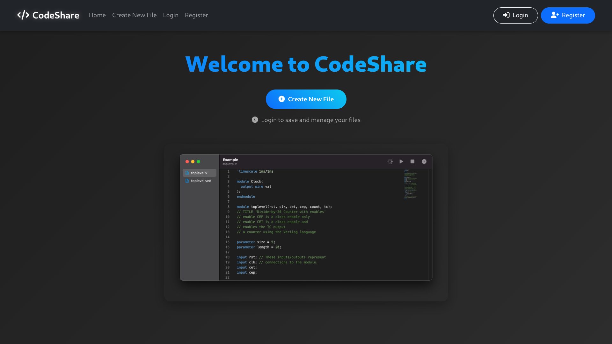

# CodeShare - Your Ultimate Online Code Editor & Sharing Platform

Welcome to CodeShare, a cutting-edge web application designed with Flask, offering developers a seamless experience to create, edit, and share code snippets in real-time. Ideal for collaboration, education, and quick code dissemination.

## 🌐 Live Demo
Experience it now: [https://codeshareapp.onrender.com](https://codeshareapp.onrender.com)

## 🚀 Key Features

### 🔐 Advanced User Authentication
- Secure account setup and login procedures
- Passwords safeguarded with industry-standard bcrypt hashing
- Enhanced security through session-based authentication

### 📝 Feature-Rich Code Editor
- User-friendly and intuitive interface for coding
- Real-time autosave functionality to prevent data loss
- Unique URLs for each code snippet for easy sharing
- Quick access to all your saved code snippets

### 💾 Efficient Data Management
- Robust and speedy SQLite database backend
- Optimized for swift code storage and retrieval
- Secure handling of user data

### 🛠️ Technical Specifications
- Developed with Flask for a lightweight and scalable solution
- RESTful API architecture for seamless integration
- Responsive UI built with Bootstrap
- Compatibility across all major browsers

## 🏁 Getting Started
1. Sign up for a free account
2. Begin coding in the editor
3. Share your code snippets with unique URLs

### Ideal for:
- Educators and learners
- Collaborative coding projects
- Quick and efficient code sharing
- Archiving code snippets for future use
